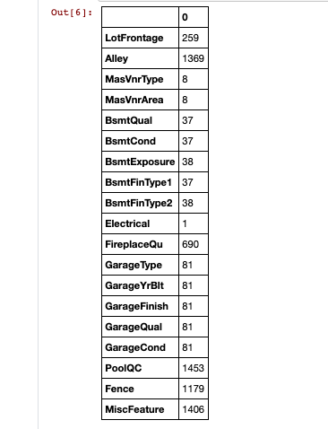
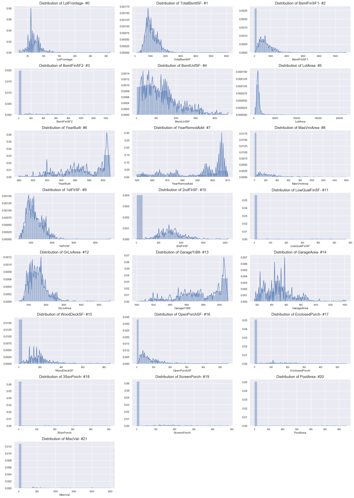
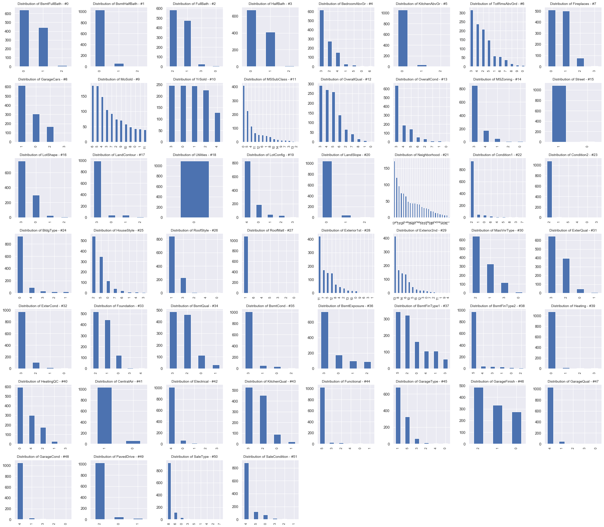
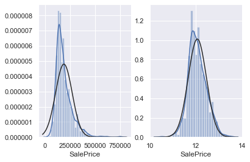
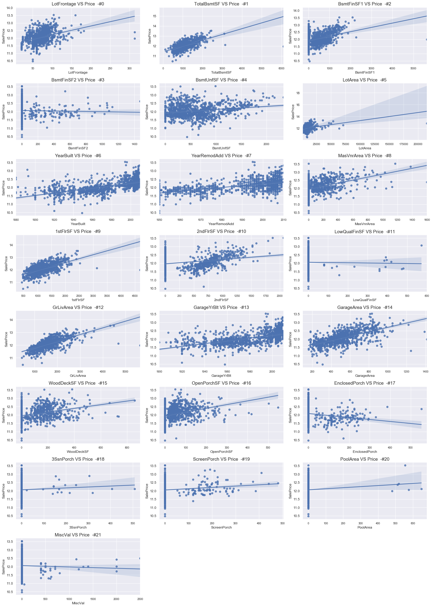
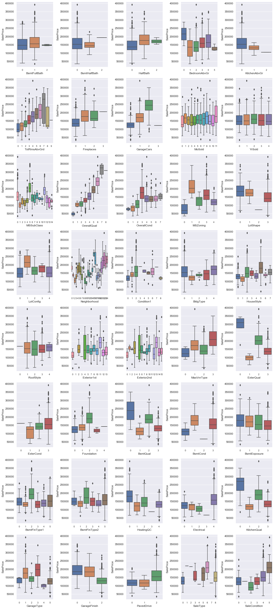
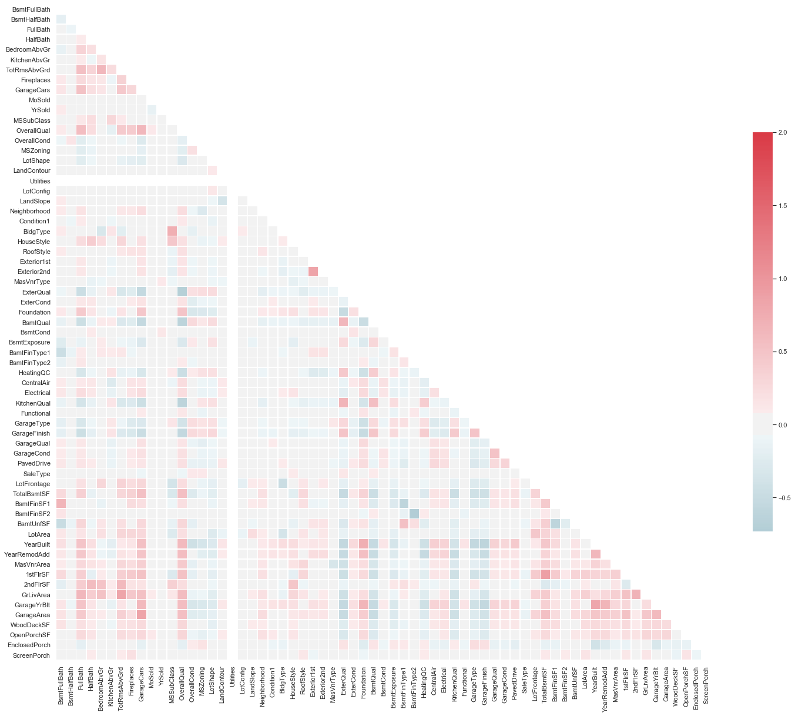

# House Prices Advanced Regression
## Introduction
The data is from [Kaggle](https://www.kaggle.com/c/house-prices-advanced-regression-techniques/data) and this is competition. You can directly download the train data and test data. With 79 explanatory variables describing (almost) every aspect of residential homes in Ames, Iowa, this competition challenges you to predict the final price of each home.
## Data Cleansing
There are many columns have missing values and as we can see that the percentage of missing values of Alley, PoolQC	, Fence	, and MiscFeature are more that 40%. I won't add those features as predictors.

## Feature Engieering
For some columns which are categorical variables need to be transformed digitally - 'BsmtFullBath','BsmtHalfBath','FullBath','HalfBath','BedroomAbvGr','KitchenAbvGr', 'TotRmsAbvGrd','Fireplaces','GarageCars', 'MoSold', 'YrSold','MSSubClass','OverallQual', 'OverallCond'.

Those columns were transformed with sklearn.preprocessing package. 
## EDA 
### Numerical Variables Distributions
First of all, the distribution plots can help us to understand those variables better. 
we can see that #3, #11,#17,#18,#19,#20,#21 have "extreme" outliers or only contain single value which means those variables are not really informative.

### Catogorical Variables Distributions
similarly, we can see 2,15,17,18,20,23,27,39,41,44,47,48, have "extreme" outliers. Those columns cannot help us to explore more and give us more information.

### Target Distribution

As we can see that the distribution of the target is right skewed and if we transform the data with "log" we can obtain normal distributed target.  

### Numerical Variables VS Target

### Catogorical Variables VS Target

### Correlation

