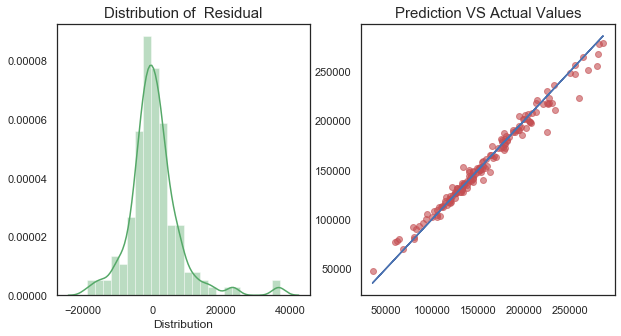

# House Prices Advanced Regression
## Introduction
The data is from [Kaggle](https://www.kaggle.com/c/house-prices-advanced-regression-techniques/data) and this is competition. You can directly download the train data and test data. With 79 explanatory variables describing (almost) every aspect of residential homes in Ames, Iowa, this competition challenges you to predict the final price of each home.
## Data Cleansing
There are many columns have missing values and as we can see that the percentage of missing values of Alley, PoolQC	, Fence	, and MiscFeature are more that 40%. I won't add those features as predictors.

## Feature Engieering
For some columns which are categorical variables need to be transformed digitally - 'BsmtFullBath','BsmtHalfBath','FullBath','HalfBath','BedroomAbvGr','KitchenAbvGr', 'TotRmsAbvGrd','Fireplaces','GarageCars', 'MoSold', 'YrSold','MSSubClass','OverallQual', 'OverallCond'.

Those columns were transformed with sklearn.preprocessing package. 
## EDA 
### Numerical Variables Distributions
First of all, the distribution plots can help us to understand those variables better. 
we can see that #3, #11,#17,#18,#19,#20,#21 have "extreme" outliers or only contain single value which means those variables are not really informative.

### Catogorical Variables Distributions
similarly, we can see 2,15,17,18,20,23,27,39,41,44,47,48, have "extreme" outliers. Those columns cannot help us to explore more and give us more information.

### Target Distribution
As we can see that the distribution of the target is right skewed and if we transform the data with "log" we can obtain normal distributed target.  
####

### Numerical Variables VS Target
we can check the linearity between numerical independent variables and dependent variables and also we can see if one independent variable and dependent variable do not have linearity, it might affect our predictive models.

Based on those scatter plots,  #1,2,5,8,9,12,15,17 charts have outliers so I removed the outliers for those variables. Then in #11, 18,20,21 variables  most values are 0 which means that those columns are not really informative.
####

### Catogorical Variables VS Target
- BsmFullBath, TotRmsAbvGrd, Fireplaces, FullBath,OverallQual and PavedDrive positively affect the housing price. 
- KitchenAbvGr and GarageFinish negatively affect the housing price. 
- The variables of MoSold, YrSold, LandSlope cannot affect the housing prices significantly.
- Since Utilities only contains one value so it cannot bring us more useful information.
- Some specific values of the variables influence the housing price. For example, if the value of HalfBath is 1, the housing price is more experience, but if the value is 3 the price is lower.  Another example is  when GarageCars is 2, housing price is more experience but when it is 0,1 or 2 the housing price is lower.
####

### Data Engineering

#### Data Standardization

#### Train test split

#### Feature Selection
This step is part of data engineering, which is to find te correlation between features. If one variable can explain another, then we just need to use one variable to predict our target so that we can get better prediction. Besides, correlation can indicate the presence of a causal relationship. In this part, the code is for removing some features if their correlations are higher 0.9. The results show that there is not any features higher than 0.9.

### Modeling
In this part, Random Forest was applied to predict the housing price. The first step is to use GridSearch to tune the parameters, and used the parameters to predict the target.
The accuracy of the validation data is up to 97%  and the RMSE is 0.57.
The distribution of the residual is normal distributed. The chart of predicted values VS actual values shows 45 degree  which means that our predicted values converge to actual values.
